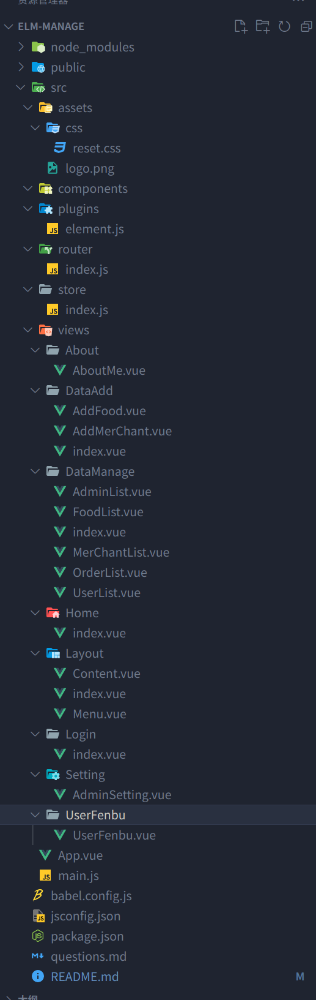

# elm-manage

## Project setup
```
yarn install
```

### Compiles and hot-reloads for development
```
yarn serve
```

### Compiles and minifies for production
```
yarn build
```

### Customize configuration
See [Configuration Reference](https://cli.vuejs.org/config/).

# 十分感谢大佬的开源后端

https://github.com/bailicangdu/vue2-elm

# 一、初始化

- 删除无关组件

  `components views`下的

- 引入相关库

  ```vue
  1. yarn add axios -S -- axios请求
  2. vue add element -- elementui(按需导入) 组件库
  	 ① 在plugns下先暂时导入完整组件，后头再删没有用到的
  	 ② 找一个组件 测试
  ```

- 引入阿里图标库

  ```css
  @import url('https://at.alicdn.com/t/font_3383924_55j4q192rgw.css?spm=a313x.7781069.1998910419.57&file=font_3383924_55j4q192rgw.css');
  
  进行测试：
      <i class="iconfont icon-shangpu"></i>
      <span>哈哈哈</span>
  ```

- 引入reset.css

  ```css
  @import url('https://at.alicdn.com/t/font_3383924_55j4q192rgw.css?spm=a313x.7781069.1998910419.57&file=font_3383924_55j4q192rgw.css');  // 引入阿里图标库
  /* @charset 'utf-8'; */
  /*这些元素都建议重新初始化*/
  body,div,dl,dt,dd,ul,ol,li,tr,td,th,
  h1,h2,h3,h4,h5,h6,hr,br,img,table,
  input,form,a,p,textarea{
      padding:0;
      margin:0;
      font-family:Arial,'Microsoft YaHei','宋体';
      font-size: 14px;
  }
  /*去掉列表默认排列*/
  ul,ol,li{
      list-style:none;
  }
  /*去掉底部横线*/
  /*把a元素更改设置成块级元素，这个根据实际情况决定要不要*/
  a{
      text-decoration:none;
  }
  /*img标签要清除border。*/
  /*display设为block设置为块级元素，默认为display:inline;
  存在下边线多出4px状况,所以一般设为block*/
  img{
      border: 0;
      vertical-align: middle;
  }
  /*清除浮动破坏带来的塌陷问题*/
  /*清除浮动的兼容IE*/
  .clearfloat {
  	zoom: 1;
  }
  .clearfloat:after {
  	display:block;
  	clear:both;
  	content:"";
  	visibility:hidden;
  	height:0;
  }
  ```

- `main.js` 引入重置reset.css

  ```js
  // 导入css重置样式表
  import './assets/css/reset.css'
  ```

- 目录结构

  

# 二、路由配置

1. 先作为测试，后续会做登录权限

   `router.vue`

   ```vue
   const routes = [
     {
       path: '/',
       name: 'Layout',
       component: Layout
     },
     {
       path: '/login',
       name: 'Login',
       component: Login
     },
   ]
   ```

   `App.vue`添加出口

   ```vue
   <router-view />
   ```

2. 配置三级路由

   - 新建index.vue里面添加标签<router-view/>

   - 完整路由配置

     ```vue
     const routes = [
       {
         path: '',
         name: 'Layout',
         component: Layout,
         children: [
           {
             path: '/',
             name: 'Home',
             component: Home
           },
           {
             path: '/datamanage',
             name: 'DataManage',
             component: DataManage,
             redirect: '/datamanage/userlist',
             children: [
               {
                 path: 'userlist',
                 name: 'UserList',
                 component: UserList
               },
               {
                 path: 'merchantlist',
                 name: 'MerChantList',
                 component: MerChantList
               },
               {
                 path: 'foodlist',
                 name: 'FoodList',
                 component: FoodList
               },
               {
                 path: 'orderlist',
                 name: 'OrderList',
                 component: OrderList
               },
               {
                 path: 'adminlist',
                 name: 'AdminList',
                 component: AdminList
               }
             ]
     
           },
           {
             path: '/dataadd',
             name: 'DataAdd',
             component: DataAdd,
             redirect: '/dataadd/addmerchant',
             children: [
               {
                 path: 'addmerchant',
                 name: 'AddMerChant',
                 component: AddMerChant
               },
               {
                 path: 'addfood',
                 name: 'AddFood',
                 component: AddFood
               }
             ]
           },
           {
             path: '/adminsetting',
             name: 'AdminSetting',
             component: AdminSetting
           },
           {
             path: '/userfenbu',
             name: 'UserFenbu',
             component: UserFenbu
           },
           {
             path: '/adout',
             name: 'About',
             component: About
           }
         ]
       },
       {
         path: '/login',
         name: 'Login',
         component: Login
       },
     ```


# 三、左侧菜单以及左侧菜单展开收起设置

## 思路

1. Menu.vue中的el-menu标签添加`:collapse="isCollapse"`设置isCollapse的值为true/false控制左侧菜单的收起以及展开
2. 因为控制展开和收起的按钮在Content.vue中，因此需要用到父传子和子传父在组件中传值
3. 因此，可以在index组件中（Menu.vue和Content.vue的父组件）中定义`isCollapse`变量，通过改变`index.vue`中`isCollapse`的值为true/false来控制左侧菜单的展开收起，默认为false展开
4. 通过父传子把`index.vue`中的`isCollapse`变量传给`Menu.vue`接收，来控制菜单的展开
5. 因为是要点击`Content.vue`中的图标来控制的，因此，在`Content.vue`的字体图标绑定点击事件，通过`this.$emit("changeCollapse")`传给`index.vue`
6. 在`index.vue`接受`@changeCollapse="changeCollapse"`并且使用取反来改变`isCollapse`的值,`this.isCollapse = !this.isCollapse;`
7. 因为控制展示隐藏的图标不能同时显示，因此，需要`index.vue`把`isCollapse`的值通过父传子传给`Content.vue`，子组件用props接收，之后通过`v-if和v-else`来控制展开收起图标的显示
8. 因为，之前的宽度是写死的，因此，当菜单收起时，右侧区域会有留白，所以可以通过`动态class`来控制留白
9. 在`index.vue`中给`<Content/>`添加动态class，设置`margin-left`的值

## 具体代码

### index.vue

```vue
<template>
  <div class="main">
    <div class="menu">
      <Menu :isCollapse="isCollapse" />
    </div>
    <div class="content">
      <Content
        @changeCollapse="changeCollapse"
        :isCollapse="isCollapse"
        :class="{ isActive: isCollapse }"
      ></Content>
    </div>
  </div>
</template>

<script>
import Menu from "./Menu.vue";
import Content from "./Content.vue";

export default {
  components: {
    Menu,
    Content,
  },
  data() {
    return {
      isCollapse: false,
    };
  },
  methods: {
    changeCollapse() {
      this.isCollapse = !this.isCollapse;
    },
  },
};
</script>

<style lang="less" scoped>
.main {
  .menu {
    background: #333;
    // width: 300px;
    // min-height: 1000px;
    // 固定定位
    position: fixed;
    top: 0;
    bottom: 0;
  }
  .content {
    margin-left: 300px;
  }
  .isActive {
    margin-left: -236px;
  }
}
</style>

```

### Menu.vue

```vue
<template>
  <div>
    <el-menu
      default-active="/"
      class="el-menu-vertical-demo"
      background-color="#333"
      text-color="#fff"
      active-text-color="#ffd04b"
      router
      :collapse="isCollapse"
    >
      <el-menu-item index="/">
        <i class="iconfont icon-shouye"></i>
        <span slot="title">首页</span>
      </el-menu-item>

      <el-submenu index="/datamanage/userlist" class="menusize">
        <template slot="title">
          <i class="iconfont icon-shujuguanli"></i>
          <span>数据管理</span>
        </template>
        <el-menu-item-group>
          <el-menu-item index="/datamanage/userlist">
            <i class="iconfont icon-yonghuliebiao"></i>
            <span>用户列表</span>
          </el-menu-item>
          <el-menu-item index="/datamanage/merchantlist">
            <i class="iconfont icon-shangjialiebiaoicon"></i>
            <span>商家列表</span>
          </el-menu-item>
          <el-menu-item index="/datamanage/foodlist">
            <i class="iconfont icon-shouyeshipin"></i>
            <span>食品列表</span>
          </el-menu-item>
          <el-menu-item index="/datamanage/orderlist">
            <i class="iconfont icon-dingdanliebiao"></i>
            <span>订单列表</span>
          </el-menu-item>
          <el-menu-item index="/datamanage/adminlist">
            <i class="iconfont icon-a-ziyuan26"></i>
            <span>管理员列表</span>
          </el-menu-item>
        </el-menu-item-group>
      </el-submenu>

      <el-submenu index="/dataadd/addmerchant">
        <template slot="title">
          <i class="iconfont icon-tianjiashuju"></i>
          <span>添加数据</span>
        </template>
        <el-menu-item-group>
          <el-menu-item index="/datamanage/userlist">
            <i class="iconfont icon-shangpu"></i>
            <span>添加商铺</span>
          </el-menu-item>
          <el-menu-item index="/dataadd/addfood">
            <i class="iconfont icon-shangpin"></i>
            <span>添加商品</span>
          </el-menu-item>
        </el-menu-item-group>
      </el-submenu>
      <el-menu-item index="/userfenbu">
        <i class="iconfont icon-tubiao-bingtu"></i>
        <span slot="title">用户分布</span>
      </el-menu-item>
      <el-menu-item index="/adminsetting">
        <i class="iconfont icon-shezhi"></i>
        <span slot="title">管理员设置</span>
      </el-menu-item>
      <el-menu-item index="/adout">
        <i class="iconfont icon-guanyu"></i>
        <span slot="title">关于我</span>
      </el-menu-item>
    </el-menu>
  </div>
</template>

<script>
export default {
  props: ["isCollapse"],
  data() {
    return {};
  },
};
</script>

<style lang="less" scoped>
.iconfont {
  font-size: 20px;
  letter-spacing: 18px;
}
.iconfont + span {
  font-size: 18px;
}
.el-menu {
  border-right: 0;
  .is-active {
    background: #222 !important;
    color: #fff !important;
  }
}
.el-menu-vertical-demo:not(.el-menu--collapse) {
  width: 300px;
  min-height: 400px;
}
</style>

```

### Content.vue

```vue
<template>
  <div>
    <div class="header">
      <i
        v-if="!isCollapse"
        @click="changeCollapse"
        class="iconfont icon-right-indent"
      ></i>
      <i
        v-else
        @click="changeCollapse"
        class="iconfont icon-bx-right-indent"
      ></i>
      顶部区域
    </div>
    <div class="content">
      <!-- 内容区域，路由出口 -->
      <router-view></router-view>
    </div>
  </div>
</template>

<script>
export default {
  props: ["isCollapse"],
  methods: {
    changeCollapse() {
      this.$emit("changeCollapse");
    },
  },
};
</script>

<style lang="less" scoped>
.header {
  background: #666;
  height: 50px;
  .iconfont {
    font-size: 24px;
  }
}
</style>

```


